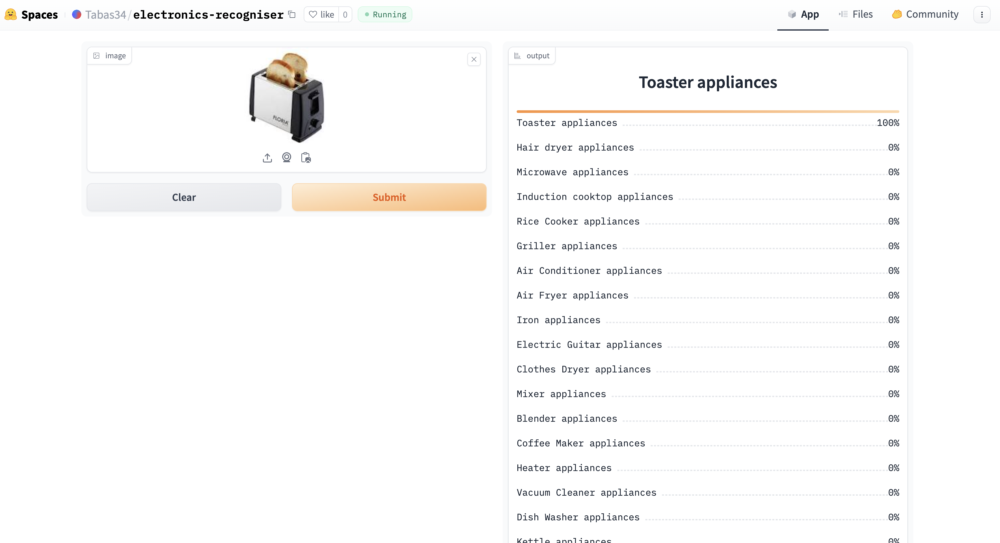

# Electronics-Recognizer
An image classification model from data collection, cleaning, model training, deployment and API intergration.  

The model can classify 22 types of electronics devices  

The types are: 
1.	AC
2.	Heater
3.	Air Fryer
4.	Blender
5.	Mixer
6.	Clothes Dryer
7.	Coffee Maker
8.	Dish Washer
9.	Electric Guitar
10.	Tooth Brush
11.	Fan
12.	Griller
13.	Hair Dryer
14.	Induction Cooktop
15.	Iron
16.	Kettle
17.	Microwave
18.	Refrigerator
19.	Rice Cooker
20.	Speaker
21.	Toaster
22.	Vacuum Cleaner

# Dataset Preparation
**Data Collection:** Downloaded from DuckDuckGo using term name  
**DataLoader:** Used fastai DataBlock API to set up the DataLoader.  
**Data Augmentation:** fastai provides default data augmentation which operates in GPU.  
Details can be found in `notebooks/electronic_data_prep.ipynb`

# Training and Data Cleaning
**Training:** Fine-tuned a resnet34 model for 5 epochs (3 times) and got upto ~90% accuracy.  
**Data Cleaning:** This part took the highest time. Since I collected data from browser, there were many noises. Also, there were images that contained. I cleaned and updated data using fastai ImageClassifierCleaner. I cleaned the data each time after training or finetuning, except for the last time which was the final iteration of the model.  

# Model Deployment
I deployed to model to HuggingFace Spaces Gradio App. The implementation can be found in `deployment` folder or [here](https://huggingface.co/spaces/Tabas34/electronics-recogniser).  

# API integration with GitHub Pages
The deployed model API is integrated [here](https://tabassumtanzim.github.io/Electronics-Recognizer/) in GitHub Pages Website. Implementation and other details can be found in `docs` folder.